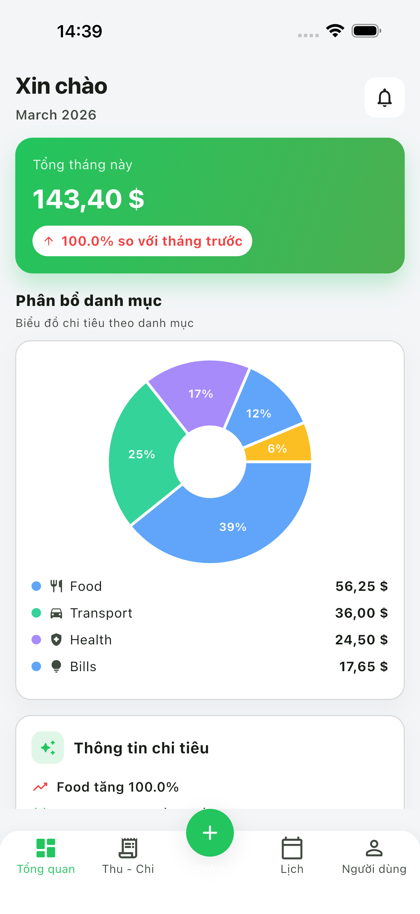

# Expense Tracker (Flutter + Express + SQLite)

A full-stack expense tracker demo built for technical interviews.

- Frontend: Flutter (Clean Architecture + feature-based)
- Backend: Node.js/Express + SQLite
- Focus: real CRUD, per-user data, currency-aware amounts, localization, theming

## Demo

### Video Demo

[](https://www.youtube.com/watch?v=udnhg-69mQ4)

### Screenshots

- Main screenshots: [docs/screenshots/demo_review_20260320/screenshots](docs/screenshots/demo_review_20260320/screenshots)
- Feature highlights: [docs/screenshots/demo_review_20260320/highlights](docs/screenshots/demo_review_20260320/highlights)



## Quick Start

### Prerequisites

- Flutter `3.32.0` (project uses FVM)
- Dart `>=3.5.0 <4.0.0`
- Node.js `>=18`
- iOS Simulator or Android Emulator

### Environment Setup (From Zero - macOS)

If you do not have a mobile dev environment yet, follow this once:

1. Install Homebrew

```bash
/bin/bash -c "$(curl -fsSL https://raw.githubusercontent.com/Homebrew/install/HEAD/install.sh)"
```

2. Install base tools

```bash
brew install git node cocoapods
brew install --cask flutter
dart pub global activate fvm
```

3. Install and pin Flutter version used by this project

```bash
cd flutter_app
fvm install 3.32.0
fvm use 3.32.0
```

4. Install Xcode (for iOS)

- Install Xcode from App Store
- Then run:

```bash
sudo xcode-select -s /Applications/Xcode.app/Contents/Developer
sudo xcodebuild -runFirstLaunch
```

5. Verify toolchain

```bash
cd flutter_app
fvm flutter doctor -v
```

6. iOS simulator quick check

```bash
open -a Simulator
cd flutter_app
fvm flutter devices
```

### 1) Run Backend

```bash
cd backend
npm install
npm start
```

Backend runs at `http://localhost:3000`.

Optional environment setup:

```bash
cd backend
cp .env.example .env
```

### 2) Run Flutter App

```bash
cd flutter_app
fvm flutter pub get
fvm flutter run
```

If you do not use FVM:

```bash
cd flutter_app
flutter pub get
flutter run
```

### 3) API Base URL Notes

`flutter_app/lib/core/network/api_client.dart` resolves base URL automatically:

- iOS simulator / desktop: `http://localhost:3000`
- Android emulator: `http://10.0.2.2:3000`

For physical devices, update to your local machine IP.

## Demo Account

A seeded account is available immediately after the backend starts for the first time:

| Field    | Value              |
| -------- | ------------------ |
| Email    | `demo@example.com` |
| Password | `123456`           |

Pre-loaded with 8 sample expenses across multiple categories and currencies. You can also register a new account directly in the app.

## App Flow

1. Setup Preferences (language, currency, theme)
2. Login / Register
3. If first login has no display name: Display Name setup
4. Open main shell
5. Dashboard tab
6. Cashflow tab
7. Add Transaction (center action)
8. Calendar tab
9. User tab

## Architecture Overview

### Flutter Structure

```text
flutter_app/lib/
  core/
    constants/
    cubit/
    di/
    extensions/
    network/
    theme/
    utils/
    widgets/
  features/
    auth/
      presentation/
        pages/
        widgets/
    expense/
      data/
        datasources/
        models/
        repositories/
      domain/
        entities/
        repositories/
        usecases/
      presentation/
        cubit/
        pages/
        widgets/
  l10n/
  main.dart
```

### Backend Structure

```text
backend/src/
  routes/
  controllers/
  services/
  models/
  utils/
  data/
```

## Key Components

### Flutter

- `SettingsCubit`: language/currency/theme + setup completion state
- `AuthCubit`: login/logout/register + display name profile update
- `DashboardCubit`: dashboard totals + insights + recent expenses
- `ExpenseFormCubit`: category loading + form validation + add/edit expense
- `ExpenseListCubit`: expense list loading + filter/sort + delete expense
- `DioApiClient`: centralized HTTP client
- Request interceptor: automatically attaches `x-username` for user-scoped APIs
- Error interceptor: normalizes network/server error messages
- Reusable UI system in `core/widgets` + `core/constants`

### Expense Feature

- Data layer: remote datasource + repository implementation
- Domain layer: entities, repository contracts, use cases
- Presentation layer: Cubit + pages + reusable feature widgets

## State Management (1 Screen = 1 Cubit)

- `DashboardPage` -> `DashboardCubit`
- `ExpenseFormPage` -> `ExpenseFormCubit`
- `ExpenseListPage` -> `ExpenseListCubit`
- Auth screens (`Login/Register/DisplayName`) -> `AuthCubit`
- Settings screens (`SetupPreferences/User settings`) -> `SettingsCubit`

## Cubit Samples

### DashboardCubit (load monthly summary + insights + recent data)

```dart
class DashboardCubit extends Cubit<DashboardState> {
  Future<void> loadDashboard({bool showLoading = true}) async {
    final response = await Future.wait<dynamic>([
      getExpensesUseCase(),
      getCategoriesUseCase(),
      getDashboardInsightsUseCase(),
    ]);
    // map and emit DashboardState.success
  }
}
```

### ExpenseFormCubit (load categories + validate + save)

```dart
class ExpenseFormCubit extends Cubit<ExpenseFormState> {
  void validateForm({
    required String title,
    required String amountText,
    required String? categoryId,
  }) {
    final amount = double.tryParse(amountText.trim());
    emit(state.copyWith(
      isFormValid: title.trim().length >= 2 &&
          amount != null &&
          amount > 0 &&
          categoryId != null,
    ));
  }
}
```

### Backend

- Auth with hashed password (`scrypt`)
- SQLite persistence (`backend/src/data/app.sqlite`)
- Per-user expense/category/insight scope via `x-username` context
- Currency-aware fields per transaction: `amount`, `currency_code`, `fx_rate_snapshot`, `amount_in_base`

## Main API Endpoints

### Health

- `GET /health`

### Auth

- `POST /auth/register`
- `POST /auth/login`
- `GET /auth/profile/:email`
- `PUT /auth/profile/display-name`

### Expenses (requires `x-username`)

- `GET /expenses`
- `POST /expenses`
- `PUT /expenses/:id`
- `DELETE /expenses/:id`

### Categories (requires `x-username`)

- `GET /categories`
- `POST /categories`

### Insights (requires `x-username`)

- `GET /insights/monthly`
- `GET /insights/category`
- `GET /insights/daily-average`
- `GET /insights/top-day`

## Localization, Theme, Currency

- Locales: English (`en_US`), Vietnamese (`vi_VN`)
- Theme modes: Light / Dark
- Currency unit setting: USD / VND
- Language and currency are independent settings

## Testing & Validation

Run Flutter static analysis and unit tests:

```bash
cd flutter_app
fvm flutter analyze
fvm flutter test
```

Test coverage includes:

- **`ExpenseListCubit`** — load, sort (latest/oldest/amount), filter by category + date range, delete
- **`ExpenseFormCubit`** — category loading, form validation (title/amount/category), save, create/delete category
- **`AuthCubit`** — login (success/failure/offline), register (validation guards), logout

## Authentication

Registration and login use **email + password**. Password is hashed with `scrypt` on the backend. All data is scoped per user via the `x-username` request header (contains the user's email after login).

## Project Highlights

- **Offline-first**: expenses are cached locally and synced when the server is reachable
- **Currency-aware**: each transaction stores original currency, FX rate snapshot, and base amount separately
- **Clean Architecture**: domain layer (entities, use cases, repository interfaces) has zero Flutter or network dependencies
- **1 Screen = 1 Cubit**: each page owns exactly one Cubit with immutable, equatable state
- **Full localization**: English and Vietnamese via ARB files — language switch takes effect immediately without restart
